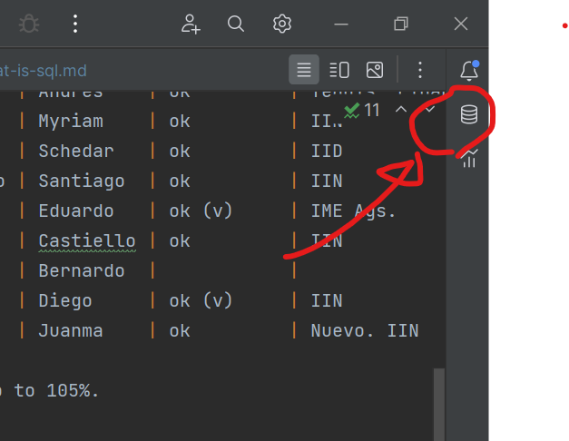
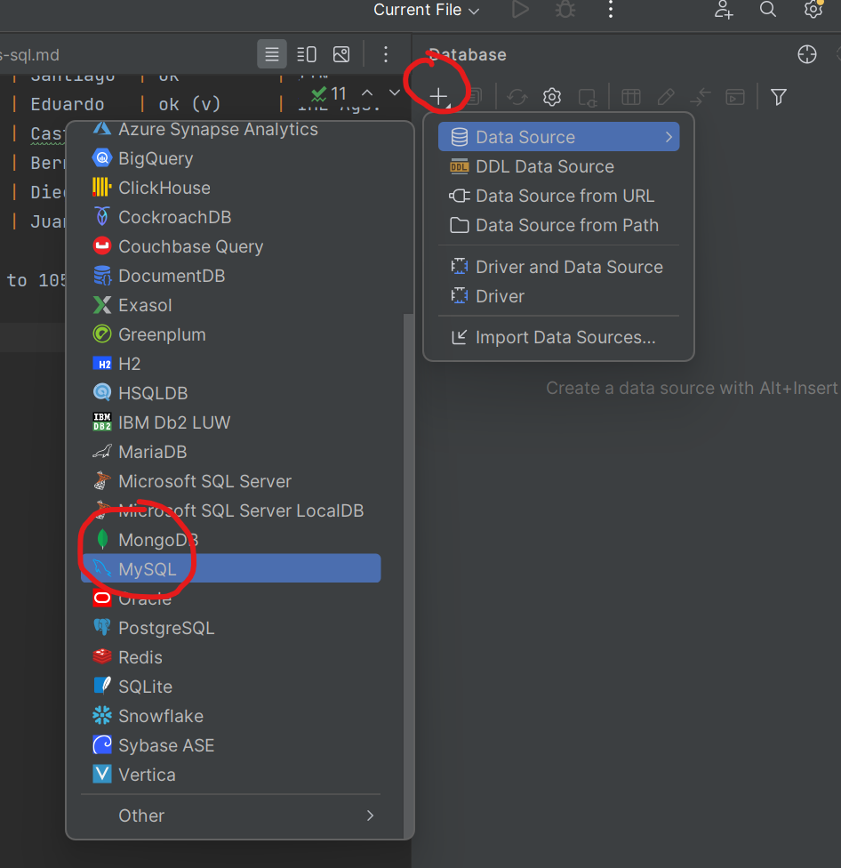
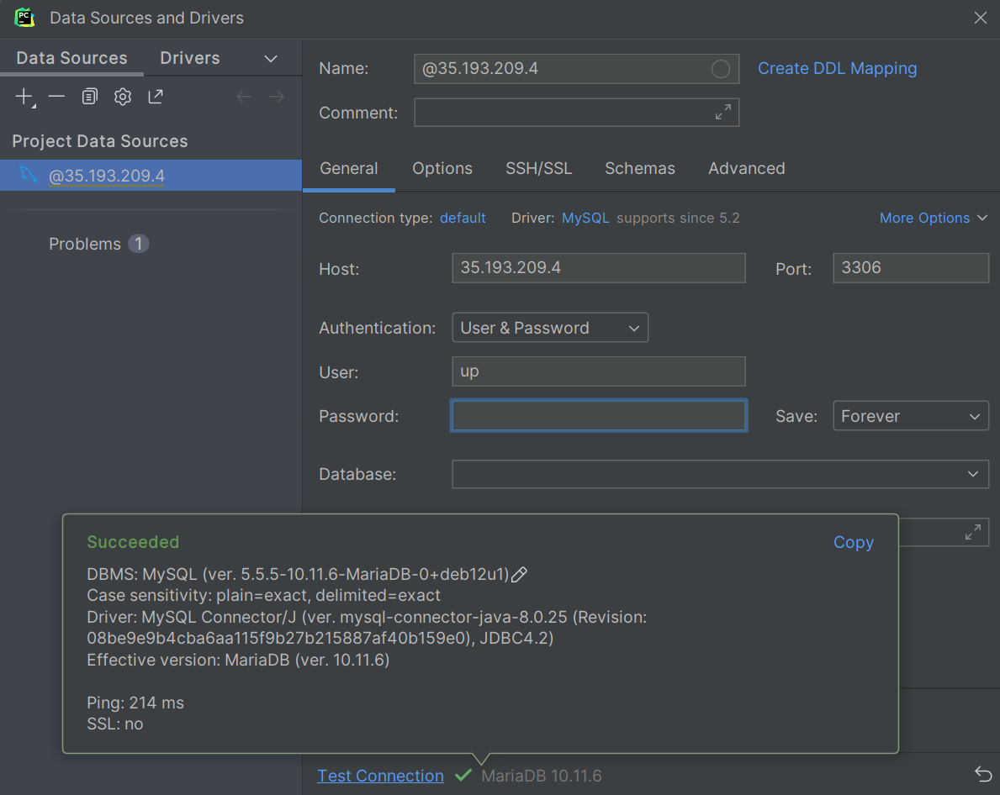
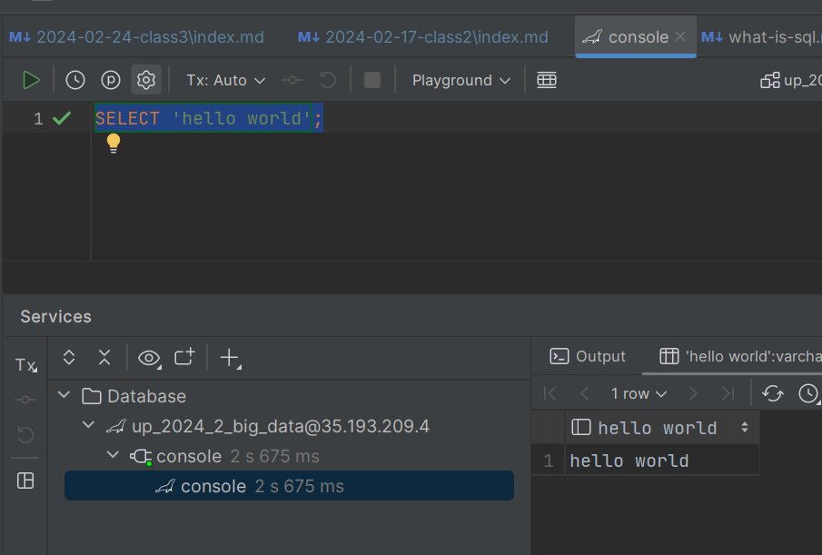

Class 2
=======

|  # | ID      | Nombre                             | A.K.A     | Asistencia | Qué carrera estudiaste  |
|---:|---------|------------------------------------|-----------|------------|-------------------------|
|  1 | 0224604 | Barba Mendoza, Paulina             | Pau       | ok         | Innovación y Diseño IID |
|  2 | 0216980 | Díaz Rizo, Edgar Leonardo          |           |            | IIN                     | 
|  3 | 0216229 | Gálvez Miranda, Uma Paola          | Uma       | ok         | Industrial IIN          | 
|  4 | 0229386 | García González, Misael            | Misael    |            |                         |
|  5 | 0228431 | García Raya, Daniela               | Dani      | ok         | Ballet. IID             |
|  6 | 0224767 | González Polit, Jorge Andrés       | Polit     | ok         | IIN                     | 
|  7 | 0225509 | González Ramos, Natanael           | Nata      | ok         | IIN                     | 
|  8 | 0220279 | Leos Luna, Zabdy Elizabeth         | Zabdy     | ok         | IME                     |
|  9 | 0225118 | Macias Lara, Hector                | Héctor    | ok         | IIN                     |
| 10 | 0234847 | De La Cruz Orozco, Marcos Gerardo  | Marcos    | ok         | IIN                     |
| 11 | 0225512 | Mendoza Guajardo, Daniel           | Mendoza   | ok         | IIN                     |
| 12 | 0224260 | Mercado Coello, Alejandro          | Alex      |            |                         | 
| 13 | 0260523 | Núñez Favela, José Andrés          | Andrés    | ok         | Tennis. Finanzas UAG    |
| 14 | 0225511 | Ochoa Garciarce, Myriam            | Myriam    | ok         | IIN                     | 
| 15 | 0218797 | Rodríguez Aquino, Schedar Emilio   | Schedar   | ok         | IID                     | 
| 16 | 0227412 | Sánchez Castillo, Santiago Mariano | Santiago  | ok         | IIN                     |
| 17 | 0213663 | Solano Jaime, Eduardo              | Eduardo   | ok (v)     | IME Ags.                |
| 18 | 0224679 | Castiello Gonzalez, Rodrigo        | Castiello | ok         | IIN                     |
| 19 | 0224764 | Blanchet Ramírez, Bernardo         | Bernardo  |            |                         |
| 20 | 0224758 | Gutiérrez Maisterrena, Diego       | Diego     | ok (v)     | IIN                     |
| 21 | 0214221 | Carrillo Contardo, Juan Manuel     | Juanma    | ok         | Nuevo. IIN              |

Note: nobody noticed the evaluation criteria adds up to 105%.

**Activity**: 10 fast fingers.

Presentation: What is SQL?

Homework: [What is SQL?](what-is-sql.md)

Configuration of Mysql DB Source in PyCharm
-------------------------------------------

Open database menu in right side of IDE



Click Add Data Source, MySql



Enter this information:

- host: `35.193.209.4`
- user: `up`
- password: `secret`
- database: `up_2024_2_big_data`



A console opens. Write this command and see if it runs successfully:

```sql
SELECT 'hello world';
```


