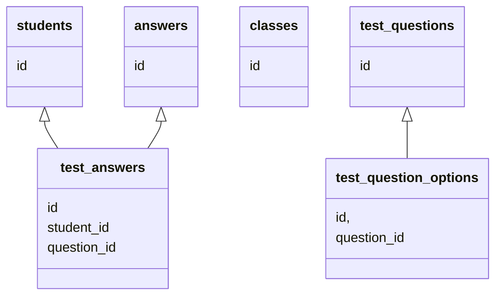

School Database
===============

- Create app for school
- App should be able to call the roll (tomar asistencia)
- Each day the teacher calls the roll he can optionally ask a "question of the day" and store
each student's answer
- Teachers should be able to make a quiz with questions of type "multiple choice" and "open"
- Students should be able to take the quiz, submit their answers
- Teachers should be able to grade the quiz results.

Tables
------

### Students

```sql
CREATE TABLE students (
    id INT PRIMARY KEY AUTO_INCREMENT,
    up_id CHAR(10),
    full_name VARCHAR(128),
    aka VARCHAR(64),
    created_at TIMESTAMP NOT NULL DEFAULT current_timestamp
);
```

```sql
INSERT INTO students (up_id, full_name, aka) VALUES
(0105123, 'Santiago Arizti Bonilla', 'Santi')
```

### Test Questions

```sql
CREATE TABLE test_questions (
    id INT PRIMARY KEY AUTO_INCREMENT,
    question VARCHAR(256),
    created_at TIMESTAMP NOT NULL DEFAULT current_timestamp
);
```

### Test Question Options

```sql
CREATE TABLE test_question_options (
    id INT PRIMARY KEY AUTO_INCREMENT,
    question_id INT,
    option_text VARCHAR(256),
    correct TINYINT,
    created_at TIMESTAMP NOT NULL DEFAULT current_timestamp
);
```

### Test Answers

```sql
CREATE TABLE test_answers (
    id INT PRIMARY KEY AUTO_INCREMENT,
    question_id INT,
    student_id INT,
    answer VARCHAR(50),
    created_at TIMESTAMP NOT NULL DEFAULT current_timestamp,
    UNIQUE KEY (question_id, student_id)
);
```

Queries
-------

Diagram
-------

To make a class diagram that shows in PyCharm and Github use a code block
with ` ```mermaid ` and something like this:

```mmd
classDiagram
    class students {
        id
    }
    class test_answers {
        id
        student_id
        question_id
    }
    class answers {
        id
    }
    class classes {
        id
    }
    class test_questions {
        id
    }
    class test_question_options {
        id,
        question_id
    }
    students <|-- test_answers
    answers <|-- test_answers
    test_questions <|-- test_question_options
```

It will render like this:


