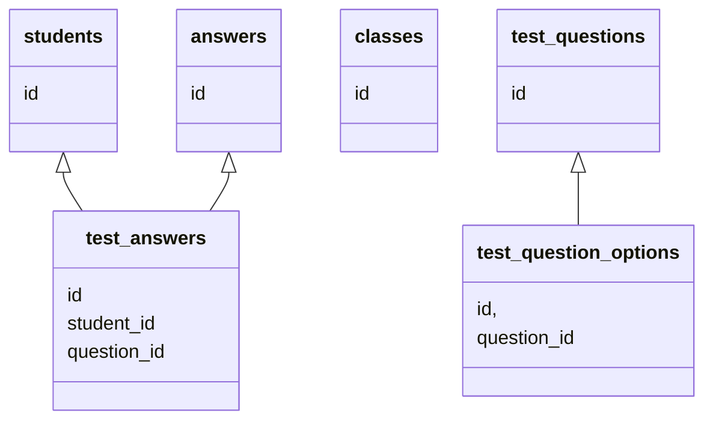

School Database
===============

Tables
------

### Students

```sql
CREATE TABLE students (
    id INT PRIMARY KEY AUTO_INCREMENT,
    up_id CHAR(10),
    full_name VARCHAR(128),
    aka VARCHAR(64),
    created_at TIMESTAMP NOT NULL DEFAULT current_timestamp
);
```

```sql
INSERT INTO students (up_id, full_name, aka) VALUES
(0105123, 'Santiago Arizti Bonilla', 'Santi')
```

### Test Questions

```sql
CREATE TABLE test_questions (
    id INT PRIMARY KEY AUTO_INCREMENT,
    question VARCHAR(256),
    created_at TIMESTAMP NOT NULL DEFAULT current_timestamp
);
```

### Test Question Options

```sql
CREATE TABLE test_question_options (
    id INT PRIMARY KEY AUTO_INCREMENT,
    question_id INT,
    option_text VARCHAR(256),
    correct TINYINT,
    created_at TIMESTAMP NOT NULL DEFAULT current_timestamp
);
```

### Test Answers

```sql
CREATE TABLE test_answers (
    id INT PRIMARY KEY AUTO_INCREMENT,
    question_id INT,
    student_id INT,
    answer VARCHAR(50),
    created_at TIMESTAMP NOT NULL DEFAULT current_timestamp,
    UNIQUE KEY (question_id, student_id)
);
```

Queries
-------

Diagram
-------

