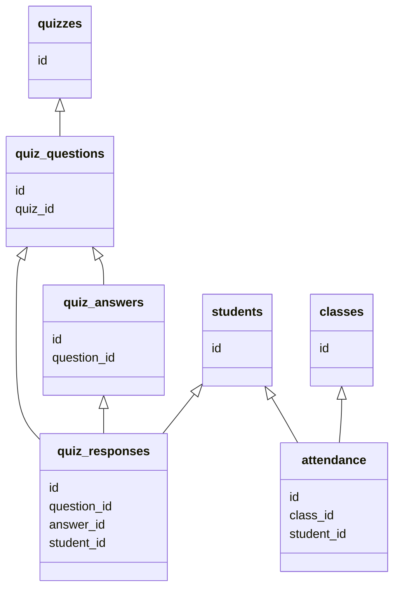

School Database
===============

- Create app for school
- App should be able to call the roll (tomar asistencia)
- Each day the teacher calls the roll he can optionally ask a "question of the day" and store
each student's answer
- Teachers should be able to make a quiz with questions of type "multiple choice" and "open"
- Students should be able to take the quiz, submit their answers
- Teachers should be able to grade the quiz results.

Tables
------

### Students

```sql
DROP TABLE IF EXISTS students;

CREATE TABLE students (
    id CHAR(10) PRIMARY KEY,
    full_name VARCHAR(128) NOT NULL,
    aka VARCHAR(64),
    created_at TIMESTAMP NOT NULL DEFAULT current_timestamp
);
```

::: details Inserts
```sql
INSERT INTO students (id, full_name, aka) VALUES
('0105123', 'Santiago Arizti Bonilla', 'Santi'),
('0224604', 'Barba Mendoza, Paulina', 'Pau'),
('0216980', 'Díaz Rizo, Edgar Leonardo', 'Leo'),
('0216229', 'Gálvez Miranda, Uma Paola', 'Uma'),
('0229386', 'García González, Misael', 'Misael'),
('0228431', 'García Raya, Daniela', 'Dani'),
('0224767', 'González Polit, Jorge Andrés', 'Polit'),
('0225509', 'González Ramos, Natanael', 'Nata'),
('0220279', 'Leos Luna, Zabdy Elizabeth', 'Zabdy'),
('0225118', 'Macias Lara, Hector', 'Héctor'),
('0234847', 'De La Cruz Orozco, Marcos Gerardo', 'Marcos'),
('0225512', 'Mendoza Guajardo, Daniel', 'Mendoza'),
('0224260', 'Mercado Coello, Alejandro', 'Alex'),
('0260523', 'Núñez Favela, José Andrés', 'Andrés'),
('0225511', 'Ochoa Garciarce, Myriam', 'Myriam'),
('0218797', 'Rodríguez Aquino, Schedar Emilio', 'Schedar'),
('0227412', 'Sánchez Castillo, Santiago Mariano', 'Santiago'),
('0213663', 'Solano Jaime, Eduardo', 'Eduardo'),
('0224679', 'Castiello Gonzalez, Rodrigo', 'Castiello'),
('0224764', 'Blanchet Ramírez, Bernardo', 'Bernardo'),
('0224758', 'Gutiérrez Maisterrena, Diego', 'Diego'),
('0214221', 'Carrillo Contardo, Juan Manuel', 'Juanma');
```
:::

### Quizzes

```sql
DROP TABLE IF EXISTS quizzes;

CREATE TABLE quizzes (
    id INT PRIMARY KEY AUTO_INCREMENT,
    title VARCHAR(64) NOT NULL,
    description VARCHAR(255),
    created_at TIMESTAMP NOT NULL DEFAULT current_timestamp,
    updated_at TIMESTAMP NOT NULL DEFAULT current_timestamp ON UPDATE current_timestamp
);
```

::: details Inserts
```sql
INSERT INTO quizzes (title, description)
VALUES ('SQL Quiz 2024-2', 'This is a quiz created by students to test our sql skills in a very meta way');
```
:::

### Quiz Questions

```sql
DROP TABLE IF EXISTS quiz_questions;

CREATE TABLE quiz_questions (
    id CHAR(3) PRIMARY KEY,
    quiz_id INT NOT NULL REFERENCES quizzes(id),
    question VARCHAR(256) NOT NULL,
    created_at TIMESTAMP NOT NULL DEFAULT current_timestamp,
    updated_at TIMESTAMP NOT NULL DEFAULT current_timestamp ON UPDATE current_timestamp
);
```

::: details Inserts
```sql
INSERT INTO quiz_questions (id, quiz_id, question) VALUES
('q01', 1, 'When you have a big table, or a big result set, and you only want to select rows that meet certain criteria, which clause do you use?'),
('q02', 1, 'When you want to reduce the number of results by aggregating (getting a sum, average, max, min, etc) using certain criteria, which clause do you use?'),
('q03', 1, 'Choose the description that best fits the clause ORDER BY'),
('q04', 1, 'SQL is a language that has many dialects: each implementation of SQL (mysql, sqlite, oracle, etc) has its own quirks, so not all SQL statements are portable between implementations.'),
('q05', 1, 'What is a "VIEW" used for in SQL?');
```
:::

### Quiz Answers

```sql
DROP TABLE IF EXISTS quiz_answers;

CREATE TABLE quiz_answers (
    id CHAR(4) PRIMARY KEY,
    question_id CHAR(3) NOT NULL REFERENCES quiz_questions(id),
    answer VARCHAR(256),
    correct TINYINT,
    created_at TIMESTAMP NOT NULL DEFAULT current_timestamp,
    updated_at TIMESTAMP NOT NULL DEFAULT current_timestamp ON UPDATE current_timestamp
);
```

::: details Inserts
```sql
INSERT INTO quiz_answers (question_id, id, answer, correct) VALUES
('q01', 'q01a', 'WHERE', 1),
('q01', 'q01b', 'FILTER', 0),
('q01', 'q01c', 'GROUP BY', 0),
('q01', 'q01d', 'LIMIT', 0),
('q01', 'q01e', 'ORDER BY', 0),
-- --
('q02', 'q02a', 'LIMIT', 0),
('q02', 'q02b', 'WHERE', 0),
('q02', 'q02c', 'FILTER', 0),
('q02', 'q02d', 'ORDER BY', 0),
('q02', 'q02e', 'GROUP BY', 1),
-- --
('q03', 'q03a', 'The ORDER BY clause sorts a result set only when GROUP BY was also used.', 0),
('q03', 'q03b', 'The ORDER BY clause sorts the results ascending from lower to higher by the first column that was selected', 0),
('q03', 'q03c', 'The ORDER BY clause sorts the results by any given column that was SELECTed and can be ascending or descending', 1),
('q03', 'q03d', 'The ORDER BY clause sorts the results descending alphabetically', 0),
('q03', 'q03e', 'The ORDER BY clause does not exist, it is called SORT BY', 0),
-- --
('q04', 'q04a', 'True', 1),
('q04', 'q04b', 'True', 0);
```
:::

### Quiz Responses

```sql
DROP TABLE IF EXISTS quiz_responses; -- submission, attempt, response, result...

CREATE TABLE quiz_responses (
    id INT PRIMARY KEY AUTO_INCREMENT,
    question_id CHAR(3) NOT NULL REFERENCES quiz_questions(id),
    student_id CHAR(10) NOT NULL REFERENCES students(id),
    answer_id CHAR(4) COMMENT 'can be null, used for multiple choice questions' REFERENCES quiz_answers(id),
    answer_text TEXT COMMENT 'only used for open questions',
    created_at TIMESTAMP NOT NULL DEFAULT current_timestamp,
    updated_at TIMESTAMP NOT NULL DEFAULT current_timestamp ON UPDATE current_timestamp,
    UNIQUE KEY (question_id, student_id)
);
```

::: details Inserts
```sql
INSERT INTO quiz_responses (question_id, student_id, answer_id) VALUES
('q01', '0105123', 'q01a'),
('q02', '0105123', 'q02b'),
('q03', '0105123', 'q03a'),
('q04', '0105123', 'q04b')
ON DUPLICATE KEY UPDATE answer_id=values(answer_id);
REPLACE INTO quiz_responses SET question_id='q05', student_id='0105123', answer_text='to view data';
```
:::

### Classes

```sql
DROP TABLE IF EXISTS classes;

CREATE TABLE classes (
    id INT PRIMARY KEY,
    class_date DATE NOT NULL,
    question_of_the_day VARCHAR(64),
    created_at TIMESTAMP NOT NULL DEFAULT current_timestamp,
    updated_at TIMESTAMP NOT NULL DEFAULT current_timestamp ON UPDATE current_timestamp
);
```

::: details Inserts
```sql
INSERT INTO classes (id, class_date, question_of_the_day) VALUES
(1, '2024-02-10', 'Algo que no sepan de mí'),
(2, '2024-02-17', 'Qué carrera estudiaste'),
(3, '2024-02-24', 'Color Favorito'),
(4, '2024-03-02', 'Donde Naciste'),
(5, '2024-03-09', 'Libro Favorito'),
(6, '2024-03-16', 'Cumpleaños'),
(7, '2024-03-23', 'Hobby'),
(8, '2024-04-13', NULL),
(9, '2024-04-20', 'Artista favorito');
```
:::

### Attendance

```sql
DROP TABLE IF EXISTS attendance;

CREATE TABLE attendance (
    id INT PRIMARY KEY AUTO_INCREMENT,
    class_id INT NOT NULL REFERENCES classes(id),
    student_id CHAR(10) NOT NULL REFERENCES students(id),
    status ENUM('present', 'absent', 'excused', 'late', 'virtual') NOT NULL,
    comment VARCHAR(128) COMMENT 'in case they explained why they were late or absent',
    answer_of_the_day VARCHAR(128),
    created_at TIMESTAMP NOT NULL DEFAULT current_timestamp,
    updated_at TIMESTAMP NOT NULL DEFAULT current_timestamp ON UPDATE current_timestamp,
    UNIQUE (class_id, student_id)
);
```

::: details Inserts
```sql
INSERT INTO attendance (class_id, student_id, status, answer_of_the_day) VALUES
(1, '0224604', 'present', 'No me gustan las oreo'),
(1, '0216980', 'absent', 'soy capricornio'),
(1, '0216229', 'present', 'Nací en el 2000'),
(1, '0229386', 'present', 'Soy de Celaya'),
(1, '0228431', 'absent', 'Ballet'),
(1, '0224767', 'present', 'No me gusta el menudo'), 
(1, '0225509', 'present', 'De chico estuve en silla de ruedas 1 año'), 
(1, '0220279', 'present', 'No me gusta mi nombre porque es difícil escribir y pronunciar'),
(1, '0225118', 'present', 'Prefiero cualquier deporte sobre futbol soccer'),
(1, '0234847', 'present', 'No me gustan los champiñones'),
(1, '0225512', 'present', 'Se supone que el corazón tiene 3 conductos para sangre al cerebro, yo nací con 2'),
(1, '0224260', 'present', 'No me gusta el plátano'), 
(1, '0260523', 'absent', 'Tennis'),
(1, '0225511', 'present', 'Me encanta el cine, menos comercial'), 
(1, '0218797', 'absent', NULL), 
(1, '0227412', 'present', 'O- de sangre'),
(1, '0213663', 'virtual', 'Arritmia permanente'),
(1, '0224679', 'present', 'Me he roto las dos rodillas, jugando fut y brincando bardas, no me gusta la c.d.m'),
(1, '0224764', 'present', 'No me gusta el jitomate, ultra Atlista.'),
(1, '0224758', 'virtual', 'Me gustan todos los deportes pero más el fut. Dejé todo por el futbol.');
INSERT INTO attendance (class_id, student_id, status, comment) VALUES
(1, '0214221', 'absent', 'No estaba enrolado en la clase todavía');
INSERT INTO attendance (class_id, student_id, status, answer_of_the_day) VALUES
(2, '0224604', 'present', 'IID'),
(2, '0216980', 'absent', 'IIN'), 
(2, '0216229', 'present', 'IIN'), 
(2, '0229386', 'absent', NULL),
(2, '0228431', 'present', 'IID'),
(2, '0224767', 'present', 'IIN'), 
(2, '0225509', 'present', 'IIN'), 
(2, '0220279', 'present', 'IME'),
(2, '0225118', 'present', 'IIN'),
(2, '0234847', 'present', 'IIN'),
(2, '0225512', 'present', 'IIN'),
(2, '0224260', 'absent', NULL),
(2, '0260523', 'present', 'Finanzas UAG'),
(2, '0225511', 'present', 'IIN'), 
(2, '0218797', 'present', 'IID'), 
(2, '0227412', 'present', 'IIN'),
(2, '0213663', 'virtual', 'IME Ags.'),
(2, '0224679', 'present', 'IIN'),
(2, '0224764', 'absent', NULL),
(2, '0224758', 'virtual', 'IIN'),
(2, '0214221', 'present', 'IIN');
INSERT INTO attendance (class_id, student_id, status, answer_of_the_day) VALUES
(3, '0224604', 'present', 'red'),
(3, '0216980', 'present', 'green'), 
(3, '0216229', 'present', 'pink'), 
(3, '0229386', 'present', 'blue'),
(3, '0228431', 'present', 'black'),
(3, '0224767', 'present', 'blue'), -- sky blue
(3, '0225509', 'absent', NULL), 
(3, '0220279', 'present', 'black'),
(3, '0225118', 'present', 'blue'),
(3, '0234847', 'absent', NULL),
(3, '0225512', 'present', 'blue'),
(3, '0224260', 'present', 'green'), 
(3, '0260523', 'absent', NULL),
(3, '0225511', 'present', 'white'), 
(3, '0218797', 'present', 'red'), 
(3, '0227412', 'present', 'red'), -- (rojiblanco)
(3, '0213663', 'virtual', 'morado'),
(3, '0224679', 'present', 'green'),
(3, '0224764', 'present', 'blue'),
(3, '0224758', 'absent', NULL),
(3, '0214221', 'present', 'green');
INSERT INTO attendance (class_id, student_id, status, answer_of_the_day) VALUES
(4, '0224604', 'present', 'Guadalajara'),
(4, '0216980', 'present', 'Guadalajara'), 
(4, '0216229', 'present', 'Guadalajara'), 
(4, '0229386', 'present', 'Brian, TX'),
(4, '0228431', 'present', 'Zapopan'),
(4, '0224767', 'present', 'Guadalajara'), 
(4, '0225509', 'present', 'Sahuayo, MICH'), 
(4, '0220279', 'absent', NULL),
(4, '0225118', 'present', 'Guadalajara'),
(4, '0234847', 'absent', NULL),
(4, '0225512', 'present', 'Guadalajara'),
(4, '0224260', 'present', 'Guadalajara'), 
(4, '0260523', 'present', 'Durango'),
(4, '0225511', 'present', 'Guadalajara'), 
(4, '0218797', 'present', 'Mazatlán'), 
(4, '0227412', 'present', 'Guadalajara'),
(4, '0213663', 'present', 'Aguascalientes'),
(4, '0224679', 'present', 'Guadalajara'),
(4, '0224764', 'present', 'Guadalajara'),
(4, '0224758', 'absent', NULL),
(4, '0214221', 'present', 'Guadalajara');
INSERT INTO attendance (class_id, student_id, status, answer_of_the_day) VALUES
(5, '0224604', 'present', 'En Llamas, Susan'),
(5, '0216980', 'absent', NULL), 
(5, '0216229', 'present', 'Los 5 Lenguajes del Amor'), 
(5, '0229386', 'present', 'Game of Thrones'),
(5, '0228431', 'present', 'La Travesía del Viajero del Alba'),
(5, '0224767', 'present', 'Crimen y Castigo'), 
(5, '0225509', 'present', 'Hábitos Atómicos'), 
(5, '0220279', 'present', 'Leonora, Elena Poniatouska'),
(5, '0225118', 'present', 'Never Split the Difference, FBI'),
(5, '0234847', 'present', 'Sherlock Holmes'),
(5, '0225512', 'late', 'La Biblia, Dios'),
(5, '0224260', 'present', 'Basta de Historias, Oppenheimer'), 
(5, '0260523', 'present', 'Outliers, Max'),
(5, '0225511', 'present', 'El Rey de Hierro'), 
(5, '0218797', 'present', 'Harry Potter y la P. Filosofal'), 
(5, '0227412', 'present', 'Los Cuatro Acuerdos'),
(5, '0213663', 'present', 'The Ocean at the end of the Lake'),
(5, '0224679', 'present', 'Inferno, Dan Brown'),
(5, '0224764', 'present', 'Memorias de Hadriano'),
(5, '0224758', 'present', 'El Monje que Vendió su Ferrari'),
(5, '0214221', 'present', 'La Tormenta de Espadas (GoT 3)');
INSERT INTO attendance (class_id, student_id, status, answer_of_the_day) VALUES
(6, '0224604', 'absent', NULL),
(6, '0216980', 'present', '01-20'), 
(6, '0216229', 'present', '04-05'), 
(6, '0229386', 'present', '12-15'),
(6, '0228431', 'present', '07-12'),
(6, '0224767', 'present', '01-22'), 
(6, '0225509', 'present', '02-24'), 
(6, '0220279', 'present', '10-06'),
(6, '0225118', 'absent', NULL),
(6, '0234847', 'present', '01-08'),
(6, '0225512', 'present', '01-24'),
(6, '0224260', 'absent', NULL), 
(6, '0260523', 'present', '07-29'),
(6, '0225511', 'present', '10-19'), 
(6, '0218797', 'present', '12-14'), 
(6, '0227412', 'absent', NULL),
(6, '0213663', 'present', '07-29'),
(6, '0224679', 'present', '08-10'),
(6, '0224764', 'present', '11-30'),
(6, '0224758', 'present', '12-23'),
(6, '0214221', 'present', '02-06');
INSERT INTO attendance (class_id, student_id, status, answer_of_the_day) VALUES
(7, '0224604', 'present', 'Patinar en hielo'),
(7, '0216980', 'present', 'Nadar'),
(7, '0216229', 'present', 'Bailar'),
(7, '0229386', 'present', 'Futbol'),
(7, '0228431', 'present', 'Pilates'),
(7, '0224767', 'late', 'Lrmar Legos'),
(7, '0225509', 'present', 'Componer música'),
(7, '0220279', 'present', 'Tocar piano'),
(7, '0225118', 'present', 'Jugar basket'),
(7, '0234847', 'present', 'Ir al cine'),
(7, '0225512', 'present', 'Escuchar música'),
(7, '0224260', 'present', 'Hiking'),
(7, '0260523', 'absent', NULL),
(7, '0225511', 'present', 'Tejer'),
(7, '0218797', 'absent', NULL),
(7, '0227412', 'present', 'Ir al estadio'),
(7, '0213663', 'absent', NULL),
(7, '0224679', 'present', 'Ir al estadio'),
(7, '0224764', 'present', 'Hiking'),
(7, '0224758', 'absent', NULL),
(7, '0214221', 'present', 'Correr');
INSERT INTO attendance (class_id, student_id, status) VALUES
(8, '0224604', 'present'),
(8, '0216980', 'absent'), 
(8, '0216229', 'present'), 
(8, '0229386', 'present'),
(8, '0228431', 'present'),
(8, '0224767', 'present'), 
(8, '0225509', 'present'), 
(8, '0220279', 'present'),
(8, '0225118', 'absent'),
(8, '0234847', 'present'),
(8, '0225512', 'present'),
(8, '0224260', 'present'), 
(8, '0260523', 'present'),
(8, '0225511', 'present'), 
(8, '0218797', 'present'), 
(8, '0227412', 'absent'),
(8, '0213663', 'present'),
(8, '0224679', 'present'),
(8, '0224764', 'present'),
(8, '0224758', 'absent'),
(8, '0214221', 'present');
```
:::

Queries
-------

Diagram
-------

