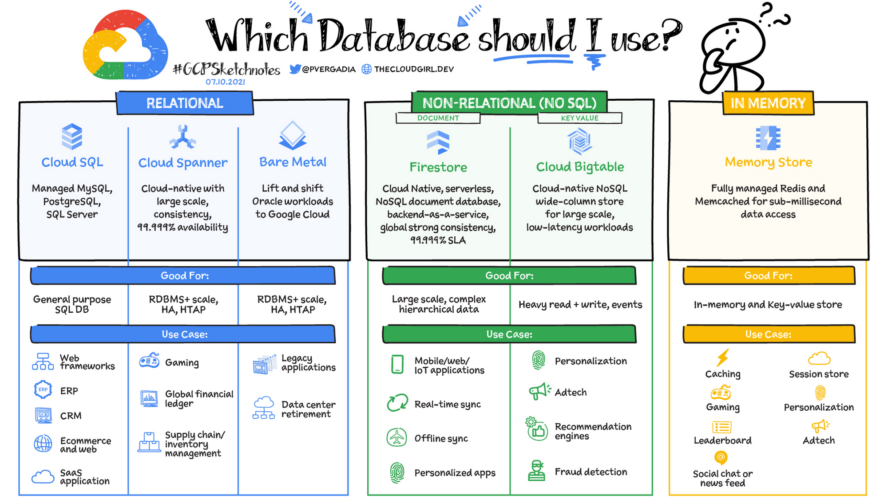
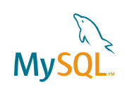

# What is SQL?

---
layout: two-cols
background: https://source.unsplash.com/collection/94734566/1920x1080
---

# Kinds of storage

## Sql

- Structured Query Language.
- Relational (tables)
- Server based
- Good for: general apps

## NoSql

- Json Path, javascript, JSON
- Stores "documents"
- Server based
- Good for: specific cases

::right::

## CSV

- No language (any language)
- Table format, like excel
- Standalone documents
- File based
- Good for: reports

## JSON

- Javascript Object Notation
- Standalone documents
- File based
- Good for: APIs

---
background: https://source.unsplash.com/collection/94734566/1920x1080
css: unocss
---

# CSV

```txt
Name,Last Name,Age,Language
Santiago,Arizti,33,English
Emilio,Arizti,7,Spanish
```

# JSON

```json
[
  {
    "name": "Santiago",
    "last_name": "Arizti",
    "age": 33,
    "languages": ["English", "Spanish"]
  },
  {
    "name": "Emilio",
    "last_name": "Arizti",
    "age": 7,
    "languages": ["Spanish"]
  }
]
```

---

# SQL

```sql
CREATE TABLE people (
    name VARCHAR(100),
    last_name VARCHAR(100),
    age INT,
    language VARCHAR(100)
);

INSERT INTO people (name, last_name, age, language)
VALUES ('Santiago', 'Arizti', 33, 'English'),
       ('Emilio', 'Arizti', 7, 'Spanish');

SELECT name, last_name, age, language
FROM people
WHERE age > 18;
```

---



---
layout: two-cols
---

# SQL Options

<style>
img {width: 200px; background-color: white}
</style>




::right::


